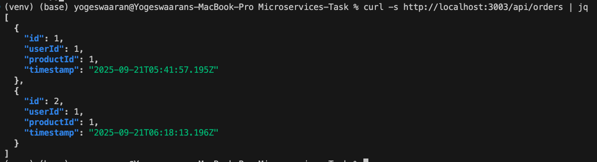

# 🚀 Microservices Containerization with Docker

## 🎯 Objective
Containerize a **microservices-based Node.js application** using **Docker** and **Docker Compose**.  

The goal is to run three independent services (**User Service**, **Product Service**, and **Gateway Service**) inside containers, connected via a shared network, and orchestrated with a single command.

---

## 📘 Introduction
This project demonstrates how to:
- Containerize Node.js services with **Docker**  
- Define dependencies and networking using **Docker Compose**  
- Run multiple services in isolated, reproducible environments  

With this setup, developers can quickly spin up the application with a single command, ensuring consistency across local, staging, and production environments.

---

## 🔎 Architecture Overview
The application consists of **three services**:

| Service            | Port | Description                                    |
|--------------------|------|------------------------------------------------|
| **User Service**   | 3000 | Handles user-related APIs                      |
| **Product Service**| 3001 | Manages product-related APIs                   |
| **Order Service**  | 3002 | Manages Order-related APIs                   |
| **Gateway Service**| 3003 | Acts as an API Gateway (depends on other services) |

Each service includes:
- Its own `Dockerfile`  
- Node.js server setup  
- Dependencies defined in `package.json`  

The `docker-compose.yml` file:
- Builds all services  
- Maps ports to the host machine  
- Connects them via a shared `app-network`  
- Restarts containers automatically if stopped  

---

## 🛠 Setup & Usage

### 1. Clone the Repository
```bash
git clone https://github.com/yogi9016/vlearn-microservices-containerization-assessment.git
cd vlearn-microservices-containerization-assessment
```

### 2. Build & Start Services
Run the following command to build and start all containers in detached mode:
```bash
docker compose up --build -d
```

### 3. Verify Running Containers
```bash
docker ps
```

### 4. Test Health Endpoints
Check if services are running:

```bash
curl http://localhost:3000/health   # User Service
curl http://localhost:3001/health   # Product Service
curl http://localhost:3002/health   # Order Service
curl http://localhost:3003/health   # Gateway Service
```

---

## 📂 User Service Dockerfile
```dockerfile
# user-service/Dockerfile
FROM node:18-alpine

WORKDIR /usr/src/app

# Install dependencies
COPY package.json ./
RUN npm install

# Copy source code
COPY . .

# Expose service port
EXPOSE 3000

# Run the application
CMD ["node", "app.js"]
```

---

## 📂 docker-compose.yml (user-service)
```yaml
services:
  user-service:
    build:
      context: ./user-service
      dockerfile: Dockerfile
    container_name: user-service
    ports:
      - "3000:3000"
    networks:
      - app-network
    restart: unless-stopped

networks:
  app-network:
    driver: bridge
```


---

## 📸 Screenshots

### ✅ Build & Run User Service


### ✅ Health Check - User Service


---

### 🏗 Repeat Steps for Other Services

To set up the remaining services (Product Service, Order Service, and Gateway Service), follow the same steps as for the User Service:

	1.	Make sure each service has its own Dockerfile and that the exposed ports are updated correctly:

        -   Product Service → 3001
        -   Order Service → 3002
        -   Gateway Service → 3003

	2.	Ensure the Gateway Service starts after the other services by using depends_on in the docker-compose.yml.

## 📂 docker-compose.yml (gateway-service)
```yaml
gateway-service:
    build:
      context: ./gateway-service
      dockerfile: Dockerfile
    container_name: gateway-service
    ports:
      - "3003:3003"
    networks:
      - app-network
    depends_on:
      - user-service
      - product-service
      - order-service
    restart: unless-stopped
```
You can view the full [docker-compose.yml](docker-compose.yml).

### ✅ Build & Run All Services

Once all services are defined, run:

```bash
docker compose up --build -d
```
### 📸 Application running:


### ✅ Docker container status:


### ✅ Health check for all services:


## 🧪 Local Testing & Validation
You can validate the APIs locally using pytest:

1.	Create a virtual environment and install required packages:

```bash
python -m venv venv

pip install pytest requests
```

2.	Add your test files in the tests folder:

-   [test_health_check.py](tests/test_health_check.py)
    -   GET http://localhost:3000 - User Service Health check 
    -   GET http://localhost:3001 - Product Service Health check 
    -   GET http://localhost:3002 - Order Service Health check 
    -   GET http://localhost:3003 - Gateway Service Health check 

-   [test_app.py](tests/test_app.py)
    -   GET http://localhost:3003/api/users - Get user list
    -   GET http://localhost:3003/api/products - Get product list
    -   GET http://localhost:3003/api/orders - Get orders list
    -   POST http://localhost:3003/api/orders - Create order with the paylaod {"userId": 1,"productId": 1}
    -   GET http://localhost:3003/api/orders - Get orders list, to check order count is increased
    
3.	Run the tests:

```bash
pytest
```


## 📝 Application - List Newly Created Orders

```bash
curl -s http://localhost:3003/api/orders | jq
```
Output: 



## ✅ Conclusion

This project demonstrates a complete microservices containerization workflow using Node.js, Docker, and Docker Compose:

-   Each service runs in its own container, ensuring isolation and portability.

-   Docker Compose orchestrates all services, sets up a shared network, and manages dependencies.

-   Services can be scaled, tested, and deployed independently.

-   Local API validation using curl or pytest ensures the application works as expected.

With this setup, developers can quickly spin up the full application environment with a single command and validate all services seamlessly.